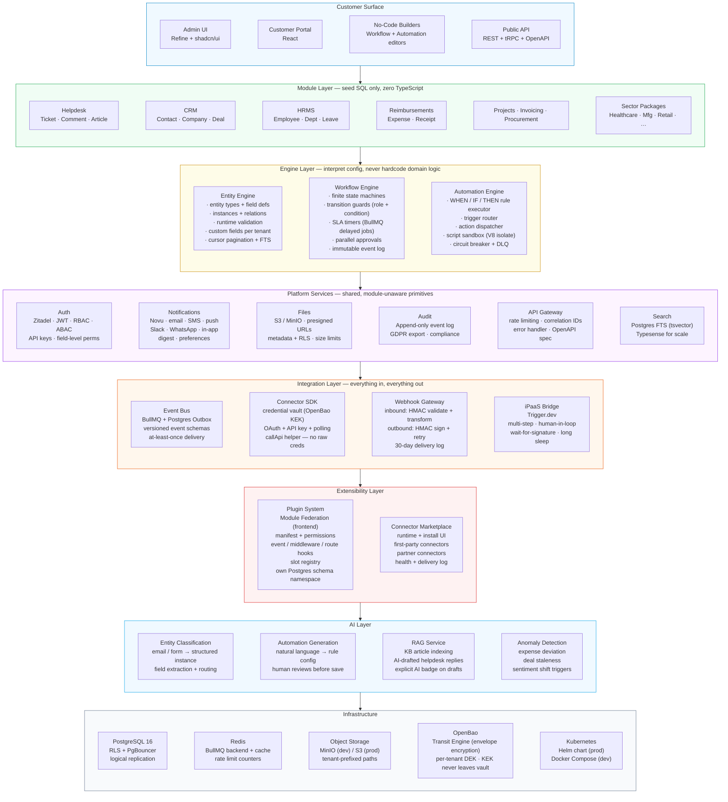
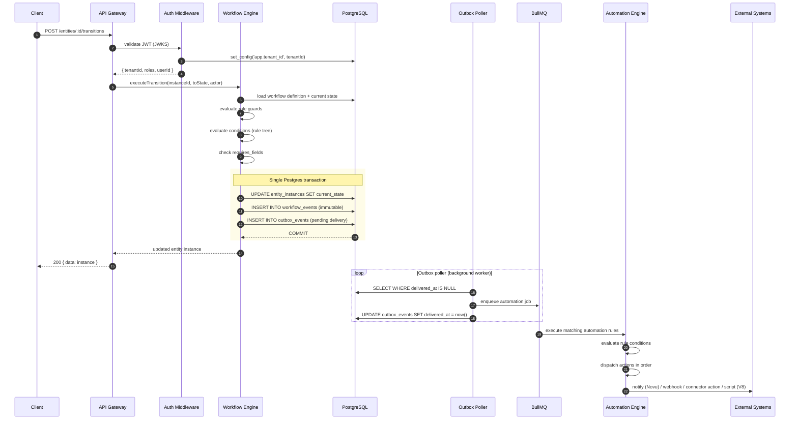
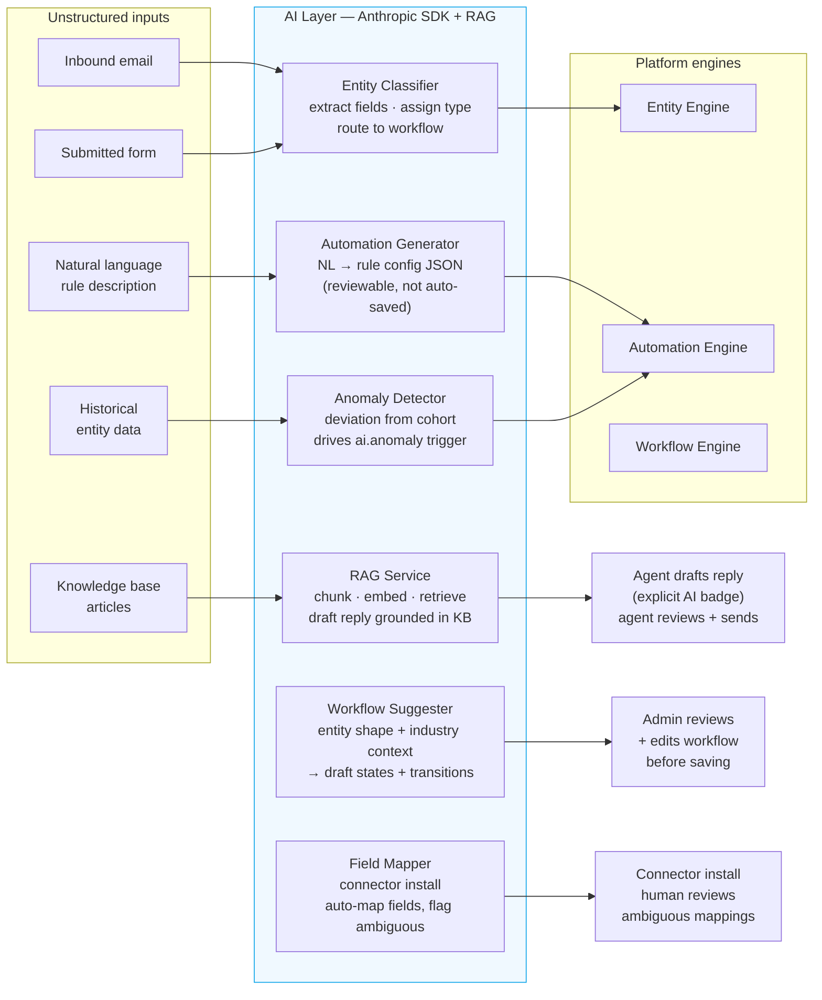
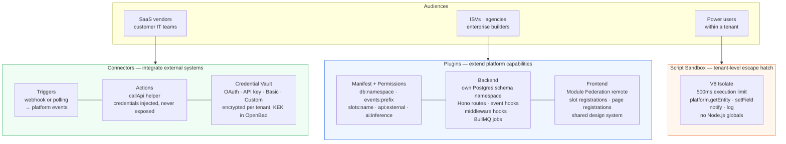

# Platform Vision — Architecture and Execution Roadmap

**Status:** Living reference. Update as phases complete.  
**Companion docs:** [architecture-brief.md](architecture-brief.md) · [sup-docs/roadmap-tracker.md](sup-docs/roadmap-tracker.md) · [sup-docs/phase-timeline.md](sup-docs/phase-timeline.md)

---

## Table of Contents

1. [Architecture — Layers and Components](#1-architecture--layers-and-components)
2. [Data Flow — Request to Side Effect](#2-data-flow--request-to-side-effect)
3. [Execution Roadmap — Phases to Full Platform](#3-execution-roadmap--phases-to-full-platform)
4. [Extensibility Model](#4-extensibility-model)

---

## 1. Architecture — Layers and Components

The platform has eight layers. Dependencies flow strictly **downward** — no layer may import from a layer above it. This is enforced at build time.



### Component index

| Layer         | Component             | What it does                                                                       |
| ------------- | --------------------- | ---------------------------------------------------------------------------------- |
| Engine        | Entity Engine         | Schema-driven CRUD for any entity type without code changes                        |
| Engine        | Workflow Engine       | State machines: guards, SLA timers, parallel approval, audit trail                 |
| Engine        | Automation Engine     | Event-driven rules with 8 trigger types, 8 action types, V8 script escape hatch    |
| Platform      | Auth                  | Zitadel JWT validation, RBAC, ABAC, API keys, field-level permissions              |
| Platform      | Notifications         | Novu wrapper — one API for all channels, user preference-aware                     |
| Platform      | Files                 | S3 presigned URLs, tenant-scoped paths, ownership-validated signing                |
| Platform      | Audit                 | Append-only event log; no UPDATE/DELETE on `workflow_events` by design             |
| Platform      | API Gateway           | Rate limiting (per-tenant), correlation IDs, structured error responses            |
| Platform      | Search                | Postgres FTS first; Typesense when tenant reaches millions of records              |
| Integration   | Event Bus             | BullMQ + Postgres Outbox — no silent event loss, versioned schemas                 |
| Integration   | Connector SDK         | Uniform interface for all external integrations; credentials never leave vault     |
| Integration   | Webhook Gateway       | Inbound HMAC validation → platform event; outbound HMAC-signed + retried           |
| Integration   | iPaaS Bridge          | Trigger.dev for flows that need sleep, human steps, or multi-system chaining       |
| Extensibility | Plugin System         | Module Federation remotes; own DB schema; hook into engine events and UI slots     |
| Extensibility | Connector Marketplace | Browse, install, configure, health-monitor all external integrations               |
| AI            | Entity Classification | Inbound unstructured content → structured entity instance with extracted fields    |
| AI            | Automation Generation | Plain-language rule description → reviewable `automation_rules` config             |
| AI            | RAG Service           | KB article indexing + AI-drafted replies; agent always reviews before send         |
| AI            | Anomaly Detection     | Deviation-from-history triggers wired into the automation engine as a trigger type |

---

## 2. Data Flow — Request to Side Effect

A transition request is the canonical example: it touches auth, the engine, the database, the event bus, and the automation engine in a guaranteed-consistent sequence.



**Key guarantees from this flow:**

- Steps 10–12 are atomic. If the transaction rolls back, no event is emitted.
- The outbox poller provides at-least-once delivery — even if the worker crashes between steps 14 and 15, the event is re-processed on recovery.
- Automation failures (step 19) never propagate back to the client. A broken rule cannot prevent a workflow transition from completing.
- RLS (`app.tenant_id` GUC, step 3) is the second line of defence. Engine queries also carry explicit `WHERE tenant_id = ?` filters as the primary guard — both are required.

---

## 3. Execution Roadmap — Phases to Full Platform

```mermaid
flowchart LR
    P0(["Phase 0\nFoundation\n✅ DONE"])
    P1(["Phase 1\nWorking Product\n✅ DONE"])
    P2(["Phase 2\nIntegration\nPlatform\n▶ NEXT"])
    P3(["Phase 3\nExtensibility"])
    P4(["Phase 4\nAI-Native"])
    P5(["Phase 5\nEnterprise +\nVerticals"])
    P6(["Phase 6\nDeveloper\nPlatform"])

    G0{"config-first test\nRLS isolation green"}
    G1{"pilot customer\nrunning live ops"}
    G2{"ext. webhook\n→ automation fires\nno code change"}
    G3{"3rd-party plugin\nships via SDK\nno core PR"}
    G4{"NL description\n→ working rule\nhuman-reviewed"}
    G5{"enterprise customer\ncompliance sign-off"}
    G6{"external dev\npublishes without\ninternal support"}

    P0 --> G0 --> P1 --> G1 --> P2 --> G2 --> P3 --> G3 --> P4 --> G4 --> P5 --> G5 --> P6 --> G6

    style P0 fill:#d1fae5,stroke:#059669
    style P1 fill:#d1fae5,stroke:#059669
    style G0 fill:#ecfdf5,stroke:#059669
    style G1 fill:#ecfdf5,stroke:#059669
    style G2 fill:#fef3c7,stroke:#d97706
    style G3 fill:#fef3c7,stroke:#d97706
    style G4 fill:#fef3c7,stroke:#d97706
    style G5 fill:#fef3c7,stroke:#d97706
    style G6 fill:#ede9fe,stroke:#7c3aed
```



---

### Phase 0 — Unbreakable Foundation `COMPLETE`

Multi-tenant infrastructure, auth, and the three engines. Every subsequent line of code runs on what was built here.

**Delivered:**

- PostgreSQL with RLS, PgBouncer, tenant lifecycle
- Zitadel JWT validation, RBAC, ABAC, API key management
- OpenBao Transit Engine (envelope encryption for secrets)
- Entity Engine: CRUD, bulk ops, full-text search, cursor pagination, soft deletes, relations, runtime validation
- Workflow Engine: `executeTransition`, pessimistic lock, SLA timers, parallel approvals, idempotency, immutable event log
- Automation Engine: outbox poller, rule executor, circuit breaker, DLQ, recursion guard
- Tenant isolation test suite (runs on every DB/API PR)
- Security hardening: ReDoS guards, cross-tenant `user_ref` validation, API key hashing

**Gate:** Any entity type + workflow + automation rule is representable as seed SQL with zero TypeScript changes. RLS isolation verified under all query patterns.

---

### Phase 1 — Working Product

Platform services complete, all standard modules live as config, config-driven UI, no-code builders, pilot customer onboarded.

**Delivers:**

```
Platform services
  @platform/notifications  Novu — email, SMS, push, Slack, WhatsApp, in-app,
                           digest batching, user channel preferences
  @platform/files          S3 presigned upload/download, RLS-enforced metadata,
                           tenant-scoped object paths, MIME type validation
  @platform/audit          Append-only event log, GDPR export endpoint,
                           compliance query API
  view_configs table        Generic UI layout definitions (field order, list columns,
                           detail groups, saved views)
  OpenAPI spec              Auto-generated from Zod schemas via @hono/zod-openapi

Module seeds (7) — INSERT statements only, zero TypeScript
  Helpdesk       Ticket · Comment · Article
                 Open → In Progress → Pending → Resolved + SLA
  Reimbursements Expense Claim · Receipt
                 Draft → Submitted → Manager Review → Finance Review → Paid
  CRM            Contact · Company · Deal · Activity
                 Lead → Qualified → Proposal → Won / Lost
  Projects       Project · Task · Milestone
                 Backlog → In Progress → In Review → Done
  HRMS           Employee · Department · Leave Request
                 Draft → Submitted → Approved / Rejected
  Invoicing      Invoice · Quote · Payment
                 Draft → Sent → Paid / Overdue / Cancelled
  Procurement    Purchase Order · Vendor · RFQ
                 Draft → Approved → Sent → Fulfilled

Config-driven UI
  Entity list view     renders columns from view_configs + field defs
  Entity detail view   renders field groups, related entity panels
  Entity form          field_type → input component mapping (all 15 types)
  Workflow action bar  getAvailableTransitions → buttons with guard feedback
  Notification center  in-app feed via Novu

No-code builders
  Automation builder   visual CRUD for automation_rules
                       trigger → condition tree → action list
  Workflow editor      visual CRUD for states + transitions
                       drag to connect, guard config inline
  Metabase embed       per-tenant analytics via signed embed tokens
                       read replica, no direct DB access from UI
```

**Gate:** Pilot customer submits tickets, SLA fires, expense claim traverses multi-level approval chain — all with zero code deployment. Installing a new module = upload a seed SQL file.

---

### Phase 2 — Integration Platform

The platform talks to the world. Every external system becomes a first-class event source and action target.

**Delivers:**

```
Connector runtime
  ConnectorDefinition interface enforced (@platform/connector-sdk)
  Credential vault — AES-256-GCM per tenant per connector, OpenBao KEK
  OAuth 2.0 PKCE flow — token storage, refresh, revocation
  API key + Basic auth flows
  Polling scheduler — BullMQ cron per connector per tenant

Webhook gateway
  Inbound   POST /webhooks/{connectorId}/{tenantId}
            → HMAC validate → transform payload → publish to event bus
  Outbound  via automation engine webhook action
            → HMAC-signed → exponential backoff → 30-day delivery log

First-party connectors
  Communication   Slack · Email (SendGrid / Postmark) · WhatsApp
  Productivity    Google Workspace · Microsoft 365
  Finance         Stripe · Razorpay
  Dev tooling     GitHub · Linear · Jira

iPaaS bridge (Trigger.dev)
  automation engine script action → spawn Trigger.dev workflow
  handles: wait-for-webhook · multi-day sleep · conditional branch · retry
  example flow:
    send contract to DocuSign
    → wait for signature event
    → create Stripe subscription
    → send onboarding sequence via Novu

Connector marketplace UI
  Browse installed + available connectors
  One-click install → OAuth or API key credential config → test connection
  Per-connector health dashboard + delivery log visible to admin
```

**Gate:** A Stripe `payment_intent.succeeded` webhook creates a platform entity and fires an automation with no code change. A tenant installs a connector, configures credentials, and maps triggers to automation rules entirely from the UI.

---

### Phase 3 — Extensibility

Third parties extend the platform without touching core code. The platform becomes a foundation others build on.

```mermaid
flowchart TB
    subgraph PLC["Plugin Lifecycle"]
        Install["Install request"] --> Resolve["Resolve dependency graph\ntopological sort"]
        Resolve --> Validate["Validate permissions\nvs tenant plan + platform version"]
        Validate --> Migrate["Run Drizzle migrations\nin transaction — rollback on failure"]
        Migrate --> Register["Register routes · hooks · jobs\nadd remote to MF config"]
        Register --> Active["Active\nhealth checks begin"]
        Active --> Uninstall["Uninstall request"]
        Uninstall --> Deregister["Deregister routes · hooks · jobs\nclear UI slots"]
        Deregister --> Drain["Drain + stop BullMQ workers"]
        Drain --> Rollback["Rollback migrations\n(if plugin supports it)"]
    end

    style Install fill:#f0fdf4,stroke:#16a34a
    style Active fill:#dbeafe,stroke:#2563eb
    style Uninstall fill:#fef2f2,stroke:#dc2626
```



**Delivers:**

```
Plugin SDK (@platform/plugin-sdk)
  PluginManifest: id · version · platformVersion range · requires · permissions
  Permission types:
    db:{namespace}        own Postgres schema (hrms.* · crm.billing.*)
    events:{prefix}       subscribe to event types (employee.*)
    slots:{name}          register into UI slot (sidebar.nav)
    api:external          make outbound HTTP calls
    ai:inference          call the platform AI service
    files:read / write

Backend wiring per plugin
  Own Postgres schema namespace — core tables never reference plugin tables
  Hono sub-router mounted at /api/{pluginId}
  Hook types:
    event       async fire-and-forget on platform events
    middleware  sync before/after entity operations — can mutate or abort
    route       full Hono router with auth context + tenant-scoped DB
  BullMQ worker definitions registered at plugin activation

Frontend wiring per plugin
  Module Federation remoteEntry.js served from CDN
  Slot registrations:
    <Slot name="sidebar.nav" />
    <Slot name="ticket.detail.sidebar" context={{ ticketId }} />
    <Slot name="dashboard.widgets" />
  Each slot wrapped in React error boundary — plugin crash = degraded slot,
  not app crash
  Pages registered at /plugin/{pluginId}/{path}

Plugin isolation
  Plugin errors: logged to plugin_errors table → DLQ after 3 retries
  Per-plugin health: healthy / degraded / failing — shown in admin UI
  Core platform continues operating normally if any plugin fails

Plugin marketplace
  Submit → code review → verified publisher badge
  Semantic version compat checks against platformVersion range
  Install counts · error rates · user ratings visible to subscribers
```

**Gate:** An external developer ships a plugin (own entity types, Hono routes, UI slots) using the published SDK. No PRs against the core platform. Plugin installs and uninstalls cleanly with full migration rollback.

---

### Phase 4 — AI-Native

Intelligence woven into the operational layer — not a chatbot bolt-on, but a participant in data, workflow, and automation.



**All AI calls are:**

- Logged per tenant for auditability
- Rate-limited per tenant
- Never used to make irreversible decisions autonomously
- Explicitly disclosed to end users where content is AI-generated

**Gate:** An admin writes "notify the finance Slack channel when an expense over ₹10,000 is submitted" and receives a complete, correct `automation_rules` config to review and save. A helpdesk agent sees an AI-drafted reply grounded in KB articles before choosing to send it.

---

### Phase 5 — Enterprise and Verticals

Moves upmarket into compliance-sensitive enterprise deals. Goes deep into vertical industries via sector packages.

**Delivers:**

```
Enterprise auth
  SAML 2.0 (Okta · Azure AD · PingFederate · Google Workspace SSO)
  SCIM provisioning (automated user + group sync from IdP)
  LDAP / Active Directory bridge
  Per-tenant MFA enforcement policy
  Session policies (timeout · concurrent session limits)

Compliance
  GDPR: right to erasure (field-level PII redaction), subject data export
  Audit log export (cryptographically signed, tamper-evident) for SOC2 / ISO27001
  Data residency: per-tenant region routing (separate Postgres cluster / schema)
  Configurable retention policies per entity type per tenant

Multi-entity (group of companies)
  Parent tenant + child tenant hierarchy
  Cross-entity consolidated dashboards and reports
  Intercompany workflows (subsidiary PO → parent approval chain)

Multi-currency
  Daily fx rate snapshot (or real-time feed)
  Currency conversion in formula fields and Metabase reports
  Multi-currency invoicing and expense claims

White-labeling
  Custom domain per tenant (CNAME + TLS cert provision)
  Custom logo · primary colour · email sender identity
  Branded customer portal and notification templates

Self-hosted Helm chart
  All platform services in a single chart with sane defaults
  Values: DB · Redis · S3 · Zitadel · Novu · OpenBao endpoints
  Enterprise SLA tier with dedicated support channel
  Air-gapped deployment option (no outbound except configured connectors)

Sector packages (each is a plugin — zero bespoke backend code)
  Healthcare      Patient · Appointment · Lab · Prescription
                  HIPAA-compliant audit · HL7/FHIR connector
  Manufacturing   BOM · Work Order · QC checkpoint · MRP · Shift schedule
                  Batch/lot tracking
  Retail / Ecomm  POS integration · multi-store inventory · loyalty programme
                  Shopify / WooCommerce connector
  Real estate     Property · Tenancy lifecycle · Lease · Inspection report
                  Agent commission calculations
  Education       Student admissions · Course · Fee collection · Gradebook
                  Parent portal · Attendance
  Logistics       Dispatch · Fleet · POD · Job scheduling · Driver management
                  Mobile field app (React Native shell)
  FinServ         KYC onboarding · Document collection · Risk scoring
                  Compliance checklist workflow
```

**Gate:** An enterprise customer signs a contract with a compliance requirement (SOC2, GDPR, data residency) and completes onboarding. The first sector package ships with no bespoke backend TypeScript outside of the module plugin structure.

---

### Phase 6 — Developer Platform

The platform becomes a platform-as-a-platform. External developers build and ship on it without internal involvement.

**Delivers:**

```
Public developer surface
  OpenAPI docs (auto-generated · versioned · hosted)
  connector-sdk + plugin-sdk as versioned npm packages on npmjs.com
  Changelog + migration guides per major version
  Developer sandbox: isolated test tenants · credential mocking · test webhooks
  CLI tooling:
    platform new connector  — scaffold ConnectorDefinition with tests
    platform new plugin     — scaffold manifest + MF build config

Partner program
  Connector certification: code review → verified badge
  Plugin certification: code review + security audit → marketplace listing
  Partner dashboard: install counts · error rates · user ratings
  Tiered revenue share for paid extensions

Marketplace public launch
  Any developer submits a connector or plugin
  Self-serve review queue
  Usage-based billing API for connector/plugin authors

Developer experience
  Local dev emulator (sandbox event bus · mock credential vault · test tenant)
  End-to-end CI tests against dev sandbox run automatically on PR
  Changelog webhook: notify connector authors of platform API changes
```

**Gate:** An external developer discovers the platform, builds a connector or plugin using public documentation and the scaffolding CLI, and publishes it to the marketplace — with no involvement from the core team at any step.

---

## 4. Extensibility Model

The platform exposes three distinct extensibility surfaces targeting different audiences and scopes.



### Comparison

|                      | Connectors                         | Plugins                                  | Script Sandbox                       |
| -------------------- | ---------------------------------- | ---------------------------------------- | ------------------------------------ |
| **Audience**         | SaaS vendors, IT teams             | ISVs, enterprise builders                | Power users within a tenant          |
| **Scope**            | External system triggers + actions | Own schema, routes, hooks, UI slots      | Inline logic in automation rules     |
| **DB access**        | None (platform events only)        | Own schema namespace (declared)          | Via `platform.getEntity` only        |
| **Frontend**         | Optional UI via slot (if plugin)   | Full Module Federation remote            | None                                 |
| **Isolation**        | Strong (credentials abstracted)    | Moderate (own namespace, error boundary) | Very strong (V8 isolate, no globals) |
| **Build complexity** | Low (implement interface)          | High (MF build pipeline + migrations)    | Zero (inline JS in rule config)      |
| **Distribution**     | Connector marketplace              | Plugin marketplace                       | Inline in automation rules           |
| **Available from**   | Phase 2                            | Phase 3                                  | Phase 0 (already live)               |

### Why connectors before plugins

The connector model solves the most immediate customer need — connect to Slack, Stripe, Gmail — with substantially lower infrastructure cost. A connector is a TypeScript class implementing one interface.

The plugin system requires the admin UI to become a Module Federation host, plugins to maintain their own build pipelines with `remoteEntry.js` outputs, CDN hosting for remote bundles, and version compatibility management between host and plugins. This is the right architecture for ISVs and sector builders. It should not gate the connector work.

**Sequencing principle:** connectors in Phase 2, plugins in Phase 3. The script sandbox is available from day one as an escape hatch. A plugin may install a connector as part of its manifest. A connector may register UI slots to show status in entity detail views. The two models compose rather than compete.

---

## Full Platform Summary

```mermaid
graph LR
    P0["Phase 0\nFoundation\n✅ DONE"]
    P1["Phase 1\nWorking Product\n✅ DONE"]
    P2["Phase 2\nIntegration\nconnectors + webhooks"]
    P3["Phase 3\nExtensibility\nplugins + marketplace"]
    P4["Phase 4\nAI-Native\nclassification + generation"]
    P5["Phase 5\nEnterprise + Verticals\ncompliance + sectors"]
    P6["Phase 6\nDeveloper Platform\npublic SDK + partner program"]

    P0 --> P1 --> P2 --> P3 --> P4 --> P5 --> P6

    style P0 fill:#d1fae5,stroke:#059669,color:#065f46
    style P1 fill:#dbeafe,stroke:#2563eb,color:#1e3a8a
    style P2 fill:#dbeafe,stroke:#2563eb,color:#1e3a8a
    style P3 fill:#dbeafe,stroke:#2563eb,color:#1e3a8a
    style P4 fill:#fef3c7,stroke:#d97706,color:#78350f
    style P5 fill:#fef3c7,stroke:#d97706,color:#78350f
    style P6 fill:#ede9fe,stroke:#7c3aed,color:#4c1d95
```



**Phases 0–3** are the core product — a working, extensible, integrated business platform.  
**Phases 4–5** are what make it defensible — AI that raises the floor on every module, enterprise compliance that unlocks larger contracts, verticals that create deep switching costs.  
**Phase 6** is the network effect — external developers building on the platform multiplies the surface area of what the platform can do, faster than the core team can build alone.

A customer who runs helpdesk with AI-drafted replies, a Stripe connector, and a third-party HRMS plugin from the marketplace is not a customer who switches easily.
